# Amazon Clone Website

A front-end replica of Amazon's homepage built with HTML and CSS. This project recreates the look and feel of Amazon's main page, including the navigation bar, search functionality, product sections, and footer.

## 🖥️ What Does It Look Like?

Here are screenshots of the different sections of our Amazon clone:

**Navigation Bar:**


**Product Sections:**


**Footer:**


## 📋 Website Structure Diagram

Here's a visual diagram showing how the website is organized:

```mermaid
graph TD
    A["🌐 Amazon Clone Website"] --> B["📊 Header Section"]
    A --> C["🎯 Hero Section"]
    A --> D["🛍️ Product Section"]
    A --> E["📋 Footer Section"]
    
    B --> B1["🏠 Main Navigation Bar"]
    B --> B2["📑 Secondary Panel"]
    
    B1 --> B1a["Amazon Logo"]
    B1 --> B1b["📍 Location<br/>'Deliver to India'"]
    B1 --> B1c["🔍 Search Bar<br/>with Dropdown"]
    B1 --> B1d["👤 Sign In<br/>Account & Lists"]
    B1 --> B1e["📦 Returns<br/>& Orders"]
    B1 --> B1f["🛒 Shopping Cart"]
    
    B2 --> B2a["☰ All Menu"]
    B2 --> B2b["💰 Today's Deals"]
    B2 --> B2c["🎁 Gift Cards"]
    B2 --> B2d["📱 Electronics Deals"]
    
    C --> C1["📢 Banner Message<br/>'You are on amazon.com'"]
    C --> C2["🖼️ Hero Background Image"]
    
    D --> D1["📦 Product Box 1<br/>Health & Personal Care"]
    D --> D2["📦 Product Box 2<br/>Health & Personal Care"]
    D --> D3["📦 Product Box 3<br/>Health & Personal Care"]
    D --> D4["📦 Product Box 4<br/>Health & Personal Care"]
    D --> D5["📦 Product Box 5<br/>Health & Personal Care"]
    D --> D6["📦 Product Box 6<br/>Health & Personal Care"]
    D --> D7["📦 Product Box 7<br/>Health & Personal Care"]
    D --> D8["📦 Product Box 8<br/>Health & Personal Care"]
    
    E --> E1["⬆️ Back to Top"]
    E --> E2["📋 Footer Links<br/>4 Columns"]
    E --> E3["🏠 Amazon Logo"]
    E --> E4["⚖️ Copyright & Legal"]
    
    style A fill:#ff9900,stroke:#333,stroke-width:3px,color:#000
    style B fill:#232f3e,stroke:#333,stroke-width:2px,color:#fff
    style C fill:#f3f3f3,stroke:#333,stroke-width:2px,color:#000
    style D fill:#ffffff,stroke:#333,stroke-width:2px,color:#000
    style E fill:#232f3e,stroke:#333,stroke-width:2px,color:#fff
```



## 🎯 What Is This Project?

This is a beginner-friendly web development project that copies Amazon's homepage design. It's perfect for learning HTML and CSS skills. The website looks like Amazon but doesn't actually sell anything - it's just for practice and learning.

## ✨ Features

### Navigation Bar
- **Amazon Logo**: Clickable logo that looks just like the real Amazon logo
- **Location Selector**: Shows "Deliver to India" with a location icon
- **Search Bar**: Full search functionality with dropdown and search button
- **Sign In**: Account and sign-in section
- **Returns & Orders**: Quick access to returns and orders
- **Shopping Cart**: Cart icon with cart counter

### Secondary Navigation
- **Menu Bar**: "All" button with hamburger menu icon
- **Quick Links**: Today's Deals, Customer Service, Registry, Gift Cards, and Sell options
- **Special Offers**: Electronics deals section

### Hero Section
- **Banner Message**: Information banner about Amazon India
- **Background Image**: Eye-catching hero background image

### Product Showcase
- **8 Product Categories**: Different product boxes showing various categories
- **Product Images**: Each box has its own product image
- **Category Titles**: Clear titles for each product category
- **"See More" Links**: Call-to-action buttons for each category

### Footer
- **Back to Top**: Quick link to scroll back to the top
- **Link Sections**: Multiple columns with useful links
- **Amazon Logo**: Footer logo section
- **Legal Information**: Copyright notice and legal links

## 🚀 How To Use This Project

### Step 1: Download the Files
1. Click the green "Code" button on this GitHub page
2. Select "Download ZIP" 
3. Extract the ZIP file to your computer

### Step 2: Open the Website
1. Find the `amazon.html` file in the extracted folder
2. Double-click on `amazon.html` 
3. Your web browser will open and show the website

### Alternative: Use Live Server (Recommended)
If you have VS Code installed:
1. Install the "Live Server" extension
2. Open the project folder in VS Code
3. Right-click on `amazon.html`
4. Select "Open with Live Server"

## 📁 What's Inside The Project?

```
amazonCloneWebsite/
├── amazon.html          # Main webpage file
├── amazon.css           # All the styling and colors
├── amazon_logo.png      # Amazon logo image
├── hero_image.jpg       # Big background image
├── box1_image.jpg       # Product category image 1
├── box2_image.jpg       # Product category image 2
├── box3_image.jpg       # Product category image 3
├── box4_image.jpg       # Product category image 4
├── box5_image.jpg       # Product category image 5
├── box6_image.jpg       # Product category image 6
├── box7_image.jpg       # Product category image 7
├── box8_image.jpg       # Product category image 8
└── README.md           # This instruction file
```

### File Descriptions

- **amazon.html**: The main file that creates the webpage structure
- **amazon.css**: Makes the website look beautiful with colors, fonts, and layouts
- **Images**: All the pictures used on the website (logo, product categories, hero image)
- **README.md**: Instructions and information about the project

## 🛠️ Technologies Used

- **HTML5**: Creates the structure and content of the webpage
- **CSS3**: Makes the website look beautiful and responsive
- **Font Awesome**: Provides icons (search icon, cart icon, location icon, etc.)
- **Google Fonts**: Uses Arial font family for clean, readable text

## 🎓 What Will You Learn?

By studying this project, you will learn:

### HTML Skills
- How to structure a webpage properly
- Using semantic HTML elements
- Creating navigation menus
- Working with images and links
- Building forms (search bar)

### CSS Skills
- **Flexbox Layout**: Modern way to arrange elements
- **Hover Effects**: Interactive elements that change when you hover
- **Responsive Design**: Making websites look good on different screen sizes
- **Background Images**: Using images as backgrounds
- **Color and Typography**: Choosing colors and fonts
- **Border and Spacing**: Creating proper spacing between elements

### Web Development Concepts
- **File Organization**: Keeping your project files organized
- **External Libraries**: Using Font Awesome for icons
- **Code Structure**: Writing clean, readable code
- **Browser Compatibility**: Making sure your website works in different browsers

## 🔧 Customization Ideas

You can modify this project to make it your own:

1. **Change the Colors**: Edit the CSS file to use different colors
2. **Add New Sections**: Create more product categories
3. **Change the Images**: Replace the product images with your own
4. **Add Animation**: Make elements move or fade in
5. **Make it Responsive**: Add mobile-friendly features
6. **Add JavaScript**: Make the search bar and buttons actually work

## 🤝 How To Contribute

If you want to help improve this project:

1. **Fork this repository** (make your own copy)
2. **Create a new branch** for your changes
3. **Make your improvements** 
4. **Test your changes** to make sure they work
5. **Submit a pull request** with a description of what you changed

### Ideas for Contributions
- Fix any bugs you find
- Add more product categories
- Improve the mobile responsiveness
- Add new features like a working search
- Improve the code comments

## 📱 Browser Support

This website works on:
- ✅ Google Chrome
- ✅ Mozilla Firefox  
- ✅ Microsoft Edge
- ✅ Safari
- ✅ Most modern browsers

## 📚 Resources for Learning More

If you want to learn more about web development:

- **HTML**: [W3Schools HTML Tutorial](https://www.w3schools.com/html/)
- **CSS**: [W3Schools CSS Tutorial](https://www.w3schools.com/css/)
- **Flexbox**: [CSS Flexbox Guide](https://css-tricks.com/snippets/css/a-guide-to-flexbox/)
- **Font Awesome**: [Font Awesome Icons](https://fontawesome.com/icons)

## ⚖️ Legal Notice

This project is for educational purposes only. Amazon and its logo are trademarks of Amazon.com, Inc. This project is not affiliated with or endorsed by Amazon.

## 📞 Questions or Problems?

If you have questions about this project or run into problems:

1. Check the code carefully for any typos
2. Make sure all image files are in the same folder as the HTML file
3. Check your browser's developer tools for error messages
4. Create an issue on this GitHub repository

## 🎉 Congratulations!

If you've successfully opened this website in your browser, you've just run your first Amazon clone! This is a great first step in web development. Keep practicing and building more projects to improve your skills.

---

**Happy Coding! 🚀**

*Feel free to explore the code, experiment with different features, and most importantly, have fun learning web development!*
